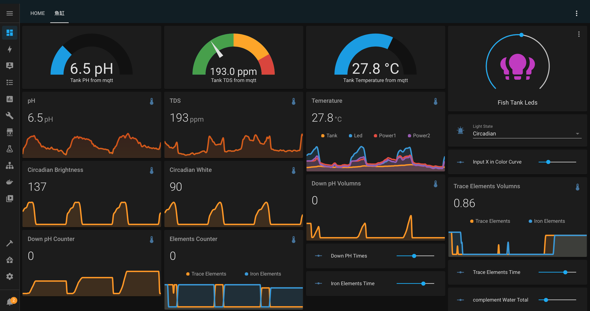
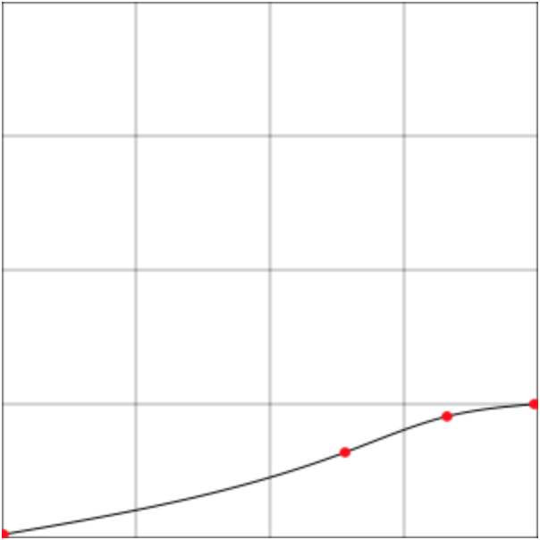
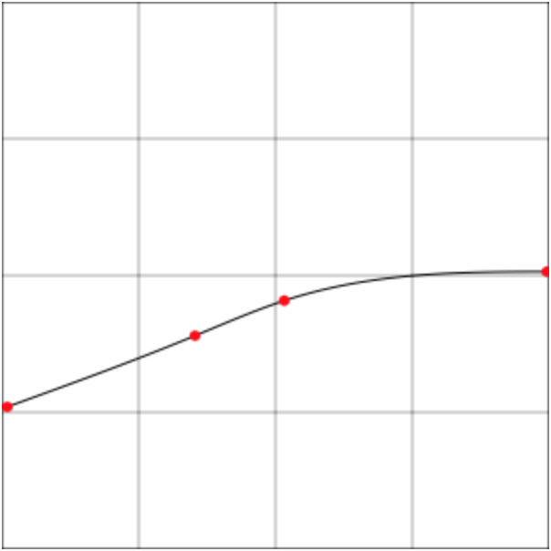
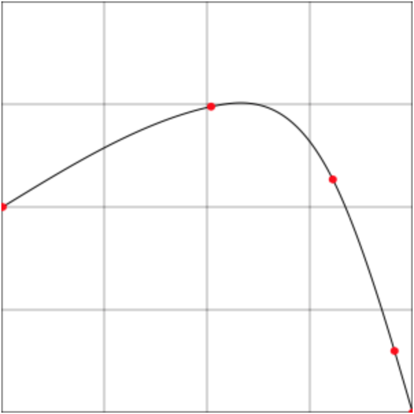
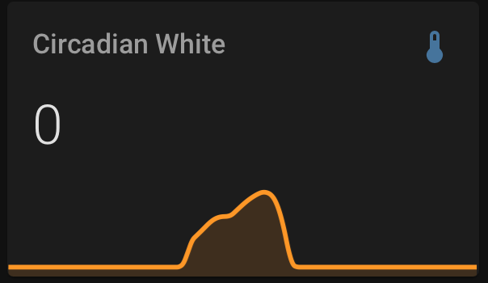
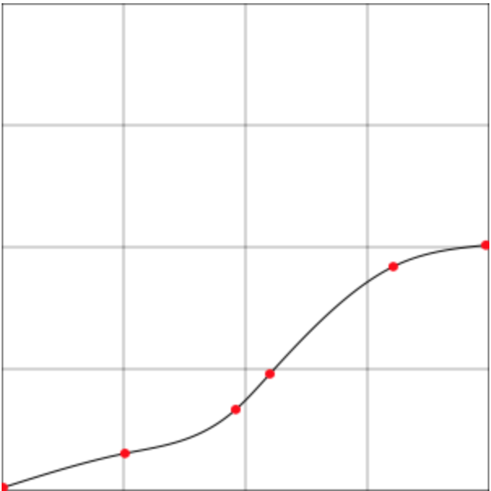
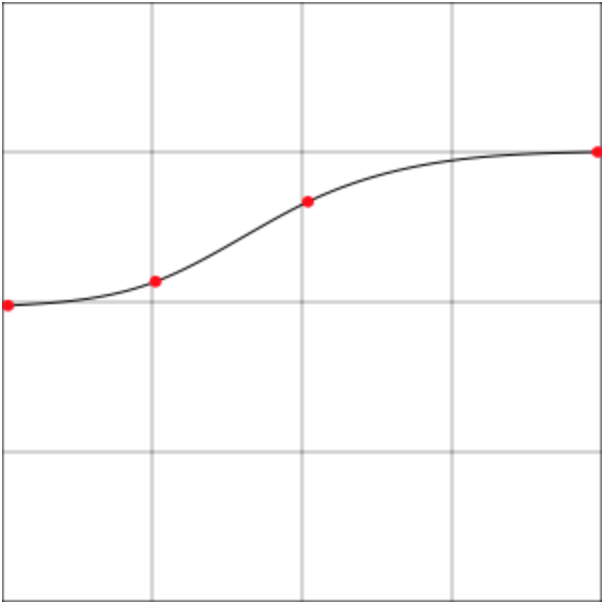
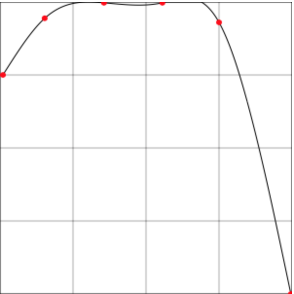
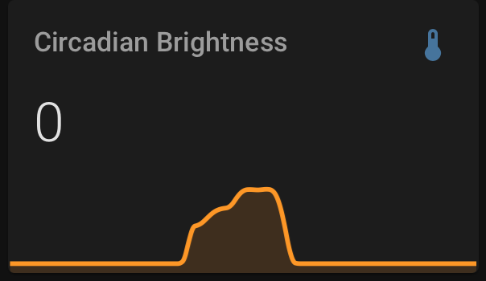
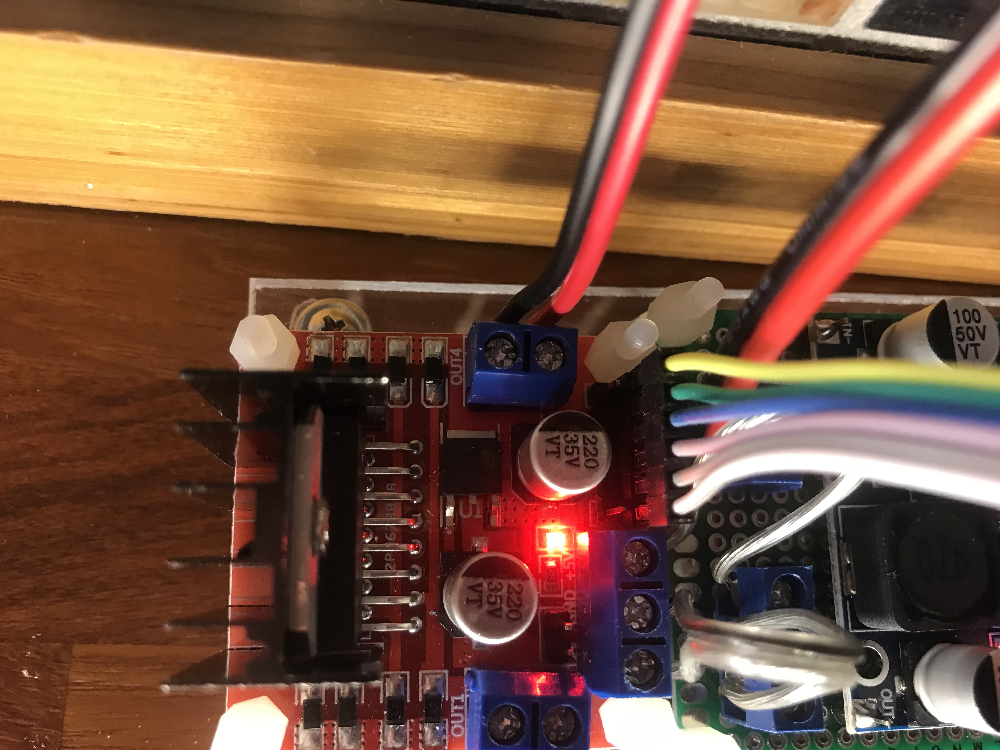

# 水草缸的AIoT

花了幾個月的時間，終於把水草缸中幾個重要的元素，包括燈光、溫度、pH值、TDS及液肥，利用IoT晶片及感測器(Sensor)搜集到統一的平台。

### 一、平台: 

使用Open Source的Home Assistant，目前Home Assistant廣泛運用在智慧家庭，用以整合小米、Apple、Google、Yeelight、IKEA、Philips 等廠商推出的智慧居家產品，像是喇叭、插座、電子鎖、電燈、各式感應器等連網設備。此外，也可以整合ESPHome及MQTT的感測器，由於架構完整且有充分的彈性，所以選擇Home Assistant為IoT平台

* Home Assistant Dashboard
 

    

### 二、水草燈: 

原本水草缸是使用T8太陽燈管，利用定時器固定開關燈時間，然而無法依據水草缸的情況進行微調或控制；因此，在規劃整體水草缸的AIoT系統時，首先就是置換水草燈。選擇新水草燈的條件: 能夠以遠端APP自由控制水草燈並且能夠以RGB三種不同顏色的波長自行控制。 
* 水草與燈光波長關係，可以參考 [燈光波長與水草關係](https://keydex.pixnet.net/blog/post/2696920)、[水草缸的光照](https://keydex.pixnet.net/blog/post/2696920)、[LED水草燈介紹: 換燈前, 你應該知道這些!!]
* [想買水草燈 先看好需要的流明跟波長再去選購唷](https://www.youtube.com/watch?v=Yh6vsoNYh00&t=24s)
* 自製Led水草燈 [自製Led水草燈(一)](https://www.youtube.com/watch?v=Di_e1m6PYcc&t=16s)、[自製Led水草燈(二)](https://www.youtube.com/watch?v=mNyaz1eiYpI&t=34s)、[自製Led水草燈(三)](https://www.youtube.com/watch?v=n_zuYQSkM3o&t=0s)

由於要對水草燈有較自由的控制，然而，對自己焊接Led沒有太多把握，最後決定找客製化的Led燈具，在網路上找到優良的[賣家](https://c.tb.cn/s5.45M5o)。經過漫長的等待(下訂到完成約一週，其餘都在物流上)，取得水草燈後，確認 Led 的控制為 Magice Home，原本以為是 ESP8266 可以很容易的整合到 Home Assistant中，殊不知卻是拿到 BL602(RISC-V)晶片。還好的是 Home Assistant有對 Magice Home的Led燈具，可以透過 Fluxled 的方式進行整合，然而，在 Home Assistant控制 Magice Home 卻有 Bug。

經過一段時間的查找及測試，終於找到如下連接提供的解決方法，並且驗證後確認可行，方能毫無限制的控制水草燈。

* [Flux_led fix for new Magic Home bl602 based controllers](https://community.home-assistant.io/t/flux-led-fix-for-new-magic-home-bl602-based-controllers/289278)

開關燈是日出日落的太陽運行方式調整燈光的亮度，且將燈具的開發時間調整在日落前的二小時，關燈時間為晚上12:00，如此設計，將會形成夏季時開燈時間較短，冬季開燈時間較長，主要考慮到水草在夏季水溫常超過 30C 生長速度較快也容易爆藻，減少燈光時間，以減緩水草的生長速度；冬天水溫可透過加溫設備，控制水溫在 24C~26C 之間，讓水草可以獲得較多燈光行光合作用。

利用 NodeRed 模擬燈光日出日落的方法，以下兩則參考資料:

* [Circadian/Adaptive Lighting NodeRed](https://community.home-assistant.io/t/circadian-adaptive-lighting-nodered/269741)
* [Improve Your Health With Smart Light Automation](https://homewithsmarts.com/2020/01/automate-your-lights-to-improve-daytime-wakefulness-and-get-a-sound-sleep/3/)

在 Node Red 的 [Spline Curve](https://flows.nodered.org/node/node-red-contrib-spline-curve)可自行規劃亮度曲線(X軸代表時間，Y軸代表亮度)，控制白光的目的在於的顯色較佳，較有觀賞價值。如圖所示，每個階段調高亮度 25%

    

下圖是在Home Assistant中，36小時中白光燈光調整的線條圖

    

控制RGB燈光(紅、綠、藍光)，只開紅光及藍光，綠光永遠關閉；植物行光合作用只需要紅光及藍光，所以，只調整紅藍光的亮度。如圖所示，第一階段即調高亮度至 50% ，其餘兩階沒各再調高亮度 25%

    

如下圖形是在Home Assistant中，36小時中紅藍光燈光調整的線條圖

    

### 三、感測器(Sensors): 

水草缸中目前已有 pH、TDS及溫度感測器。這三種感測器 (Sonsors)是利用 Arduino 加上 ESP8266 Shield 透過 MQTT 上傳到 Home Assistant中

主要材料:

* Arduino R3: 1片
* ESP8266 Shield: 1片
* L298n: 1片
* 數位溫度感測試 ds18b20: 4條
* [Gravity: Analog pH Sensor/Meter Kit V2](https://www.dfrobot.com/product-1782.html): 1組
* [Gravity: Analog TDS Sensor/Meter for Arduino](https://www.dfrobot.com/product-1662.html): 1組

      

* pH: pH 值在觀察後大約在 6.3~6.9 之間。在開燈後，因水草行光合做用吸收 CO2，讓 pH 由最低一路往上昇到燈亮度最高的時該；關燈後，由於 CO2 持續打，pH 值會從最高點持續降到開燈前的最低點(大約 6.3 左右)。
 
* [深入分析氨~銨~PH~硝化菌他們之間的關聯](https://www.youtube.com/watch?v=ZkAH9GeI50c&t=413s)

    

* TDS: [TDS](https://www.ec-ff.com/blog/posts/fancy-water-what-is-tds)(Total Dissolved Solids)是溶解性總固體值，「溶解固體」是指溶解於水中的任何礦物質，鹽、金屬、陽離子或陰離子。而溶解性總固體值包含鈣、鎂、鉀、鈉等無機鹽，和少量溶於水的有機物。在水草缸中 TDS 可以用來檢視在水體中添加的液肥或餵食魚隻的餌料是否超標；當 TDS 過高(250 或 300 ppm)時會影響水草對養分的吸收，水草長得好與壞 TDS 是關鍵指標。

* [當你不知道哪時候該換水 可以參考看看水中的TDS數](https://www.youtube.com/watch?v=Fvwlbusd24I)

    

* 溫度: 溫度感測試共有四處，水草缸、Led燈、Led燈的兩個變壓器上，Led燈及Led燈變壓器的溫度皆利用風扇的風量大小，來達到降溫，在開燈的情況下，一般多可控制在 40C 以下。水草缸的溫度，也提供給 pH/TDS 感測器進行溫度補償。

    

### 四、控制與自動化:

自動化控制目前已有自動加液肥、調降 pH 值(水寶)、自動補水及風扇調整。液體的添加是利用蠕動泵，控制在最小轉速，每次轉 1 秒鐘慢慢潻加。設缸時是採用[懶人缸水草造景工作室](http://www.0982399414.tw)，基準的液肥添加量及pH控制皆是當年設缸([102年新春第一座生態懶人缸](http://www.0982399414.tw/index.php?option=com_content&view=article&id=225:102&catid=41:2008-10-02-06-50-43&Itemid=34))李師父及袁師父傳授的標準。等參考數據搜集足夠後，再利用 AI 的方法，修改每日添加量。

主要材料:

* Nodemcu-32: 2片
* L298n: 3片
* 蠕動泵: 5個
* 降壓模組 LM2596S: 1片 

* 液肥: 液肥有添加微量元素及鐵肥。微量元素先控制每天在晚上 7:00~8:00 之間，現在設定為 每日添加上限為 1cc；鐵肥則控制在晚上 12:00 關燈後添加，也是每日設定上限為 1cc。同時也留下可以調整每日添加量的接口(interface)，可以 Home Assistant 中設定上限值，之後進行 AI 的訓練後推論 (Inference)，也預計填入該接口。

* 調整 pH 值: 控制 pH 值在於兩方面，開燈時控制 pH 的高點不超過 6.7；關燈後持續打 CO2，會讓 pH 值持續下降，不低於 6.3。添加水寶調降pH值，使用兩個蠕動泵，一為水寶，另一為自來水稀釋50倍，避免水體 pH 波動過大；CO2目前使用降壓閥，每秒大約 1 顆的情況下，到開燈前不會低於 6.3。

* 自種補水: 幾個月的觀察下來，水的自然蒸發，每日超過 1 公升，在扣除調降 pH 稀釋的水量後，再補水至 1200 cc

### 五、未來利用 AI 調整液肥、pH或燈光

